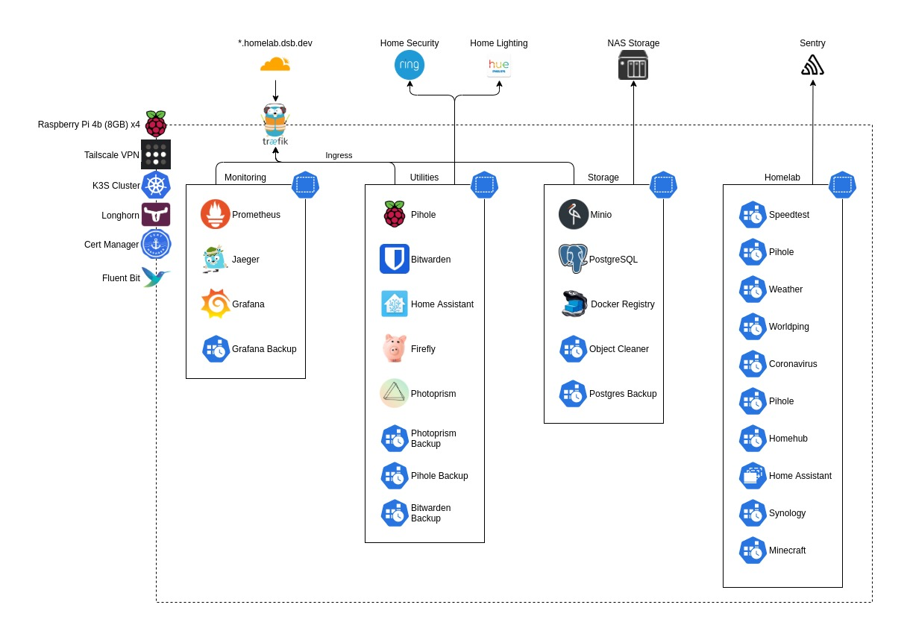

# homelab [](https://pkg.go.dev/github.com/davidsbond/homelab) [](https://goreportcard.com/report/github.com/davidsbond/homelab)

Monorepo for my personal homelab. It contains applications and kubernetes manifests for deployment.

<!-- ToC start -->
   1. [Getting started](#getting-started)
   1. [Project structure](#project-structure)
   1. [Third party applications](#third-party-applications)
   1. [Prometheus exporters](#prometheus-exporters)
   1. [Other tools](#other-tools)
   1. [External services](#external-services)
   1. [Cluster upgrades](#cluster-upgrades)
   1. [Node maintenance](#node-maintenance)
      1. [Crontab](#crontab)
      1. [K3s services](#k3s-services)
      1. [Overclocking](#overclocking)
      1. [Multipath](#multipath)
   1. [Managed infrastructure](#managed-infrastructure)
      1. [Terraform Providers](#terraform-providers)
      1. [Database provisioning](#database-provisioning)
      1. [Docker images](#docker-images)
   1. [Environment](#environment)
<!-- ToC end -->

## Getting started

This assumes you have the following tools:

* [go](https://golang.org/)
* [kubectl](https://kubernetes.io/docs/reference/kubectl/kubectl)
* [kustomize](https://kubernetes.io/docs/tasks/manage-kubernetes-objects/kustomization)
* [make](https://www.gnu.org/software/make/manual/make.html)
* [buildx](https://docs.docker.com/buildx/working-with-buildx/)
* [terraform](https://www.terraform.io/)

To start working:

* Clone the repository
* Install golang-based tools using `make install-tools`
* Run `make` to build all binaries

## Project structure

* `cmd` - Entry points to any bespoke applications.
* `hack` - Node host specific config files and tweaks.
* `internal` - Packages used throughout the application code.
* `manifests` - Kubernetes manifests to run all my homelab applications.
* `scripts` - Bash scripts for working within the repository.
* `terraform` - Terraform files for managing infrastructure.
* `vendor` - Vendored third-party code.

## Third party applications

Here's a list of third-party applications I'm using alongside my custom applications:

* [longhorn](https://longhorn.io/) - Cloud native distributed block storage for Kubernetes.
* [home-assistant](https://www.home-assistant.io/) - Open source home automation that puts local control and privacy first.
* [pihole](https://pi-hole.net/) - A black hole for Internet advertisements.
* [traefik](https://traefik.io/) - The Cloud Native Application Proxy.
* [prometheus](https://prometheus.io/) - The Prometheus monitoring system and time series database.
* [grafana](https://grafana.com/) - The open observability platform.
* [jaeger](https://www.jaegertracing.io/) - Open source, end-to-end distributed tracing.
* [node-exporter](https://github.com/prometheus/node_exporter) - Exporter for machine metrics.
* [minio](https://min.io/) - High Performance, Kubernetes Native Object Storage.
* [postgres](https://www.postgresql.org/) - The world's most advanced open source database.
* [firefly](https://www.firefly-iii.org/) - A free and open source personal finances manager.
* [photoprism](https://photoprism.pro/features) - Personal Photo Management powered by Go and Google TensorFlow.
* [cert-manager](https://cert-manager.io/) - x509 certificate management for Kubernetes.
* [docker-registry](https://docs.docker.com/registry/) - A stateless, highly scalable server side application that stores 
  and lets you distribute Docker images
* [fluent-bit](https://fluentbit.io/) - Log processor and forwarder

## Prometheus exporters

I've implemented several custom prometheus exporters in this repo that power my dashboards, these are:

* `coronavirus` - Exports UK coronavirus stats as prometheus metrics
* `homehub` - Exports statistics from my BT HomeHub as prometheus metrics
* `pihole` - Exports statistics from my pihole as prometheus metrics
* `speedtest` - Exports [speedtest](https://speedtest.net) results as prometheus metrics
* `weather` - Exports current weather data as prometheus metrics
* `worldping` - Exports world ping times for the local host as prometheus metrics
* `home-assistant` - Proxies prometheus metrics from a home-assistant server.
* `synology` - Exports statistics from my NAS drive.
* `minecraft` - Exports statistics for my Minecraft server.

## Other tools

Here are other tools I've implemented for use in the cluster.

* `bucket-object-cleaner` - Deletes objects in a blob bucket older than a configured age.
* `grafana-backup` - Copies all dashboards and data sources from grafana and writes them to a MinIO bucket.
* [db-backup](https://github.com/davidsbond/db-backup) - A backup utility for databases.
* `ftp-backup` - Copies all files from a specified path of an FTP server and writes them to a MinIO bucket.

## External services

These are devices/services that the cluster interacts with, without being directly installed in the cluster.

* [Ring](https://ring.com/) - Home security devices, connected via home-assistant
* [Tailscale](https://tailscale.com/) VPN - Used to access the cluster from anywhere
* [Synology](https://www.synology.com/) NAS - Used as the storage backend for minio, primarily used for volume backups
* [Phillips Hue](https://www.philips-hue.com/en-gb) - Smart lighting, connected via home-assistant
* [Cloudflare](https://www.cloudflare.com/) - DNS, used to access my applications under the `*.homelab.dsb.dev` domain.

## Cluster upgrades

Upgrading the k3s cluster itself is managed using Rancher's [system-upgrade-controller](https://github.com/rancher/system-upgrade-controller).
It automates upgrading the cluster through the use of a CRD. To perform a cluster upgrade, see the [plans](manifests/kube-system/system-upgrade-controller/plans)
directory. Each upgrade is stored in its own directory named using the desired version, when the plan manifests get applied
via kustomize jobs will be started by the controller that upgrade the master node, followed by the worker nodes. The upgrade only takes
a few minutes and tools like `k9s` and `kubectl` will not be able to communicate with the cluster for a small amount of time while
the master node upgrades.

## Node maintenance

The [hack](./hack) diretory at the root of the repository contains files used on all nodes in the cluster.

### Crontab
 
The `crontab` file describes scheduled tasks that clear out temporary and old files on the filesystem 
(/tmp, /var/log etc) and performs package upgrades on a weekly basis. It will also prune container images that are no 
longer in use.

The crontab file can be deployed to all nodes using the `make install-cron-jobs` recipe. This command will copy over the
contents of the local crontab file to each node via SSH. You need to have used `ssh copy-key-id` for each node, so you 
don't get any password prompts.

### K3s services

The `k3s.service` and `k3s-agent.service` files are the `systemd` service files that run the service and agent nodes. It
sets the cluster to communicate via the Tailscale network and stops k3s from installing traefik. This is because I run
traefik 2, whereas k3s comes with 1.7 by default.

### Overclocking

The `usercfg.txt` file is stored at `/boot/firmware/usercfg.txt` and is used to set overclocking values for the Raspberry
Pis. Pretty certain this voids my warranty, so if you're not me and planning on using this repository you should keep that
in mind.

See [Overclocking options in config.txt](https://www.raspberrypi.org/documentation/configuration/config-txt/overclocking.md)
for more details on these values.

### Multipath

The `multipath.conf` file is the configuration file for the multipath daemon. It is used to overwrite the built-in 
configuration table of `multipathd`. Any line whose first non-white-space character is a '#' is considered a comment line. 
Empty lines are ignored.

The sole reason for this existing, is to handle [an issue with longhorn](https://github.com/longhorn/longhorn/issues/1210)
that I was experiencing.

## Managed infrastructure

Some aspects of the homelab are managed using Terraform. These include DNS records via CloudFlare. To plan and apply
changes, use the `Makefile` in the [terraform](./terraform) directory. The `make plan` and `make apply` recipes will
perform changes.

The terraform state is included in this repository. It is encrypted using strongbox, which is installed when using
`make install-tools`.

### Terraform Providers

This list contains all terraform providers used in the project:

* [cloudflare](https://registry.terraform.io/providers/cloudflare/cloudflare/latest/docs)
* [minio](https://github.com/aminueza/terraform-provider-minio)
* [grafana](https://registry.terraform.io/providers/grafana/grafana/latest/docs)
* [tailscale](https://registry.terraform.io/providers/davidsbond/tailscale/latest/docs)

### Database provisioning

New postgres databases can be provisioned using a kubernetes `Job` resource using the `createdb` binary included in standard
`postgres` docker images. Below is an example:

```yaml
apiVersion: batch/v1
kind: Job
metadata:
  name: example-db-init
spec:
  template:
    spec:
      containers:
        - image: postgres:13.1-alpine
          name: createdb
          command:
            - createdb
          env:
            - name: PGHOST
              value: postgres.storage.svc.cluster.local
            - name: PGDATABASE
              value: example
            - name: PGUSER
              valueFrom:
                secretKeyRef:
                  key: postgres.user
                  name: postgres
            - name: PGPASSWORD
              valueFrom:
                secretKeyRef:
                  key: postgres.password
                  name: postgres
      restartPolicy: Never
  backoffLimit: 0
```

You can view the documentation for the `createdb` command [here](https://www.postgresql.org/docs/current/app-createdb.html).

### Docker images

The cluster contains a deployment of the docker registry that is used as a pull-through proxy for any images hosted
on hub.docker.com. When referencing images stored in the main library, like `postgres` or `busybox`, you use the image
reference `registry.homelab.dsb.dev/library`. Otherwise, you just use the repository/tag combination. This increases
the speed at which images are pulled and also helps with docker's recent change to add API request limits.

## Environment

* 4 [Raspberry Pi 4b](https://www.raspberrypi.org/products/raspberry-pi-4-model-b/) (8GB RAM)
* Kubernetes via [k3s](https://k3s.io/)
* [Zebra Bramble Cluster Case](https://www.c4labs.com/product/zebra-bramble-case-raspberry-pi-3-b-color-and-stack-options/) from [C4 Labs](https://www.c4labs.com/)
* 4 [SanDisk Ultra 32 GB microSDHC](https://www.amazon.co.uk/gp/product/B073JWXGNT) Memory Cards
* 4 [SanDisk Ultra Fit 128 GB USB 3.1 Flash Drive](https://www.amazon.co.uk/gp/product/B07855LJ99) USB Drives
* [Synology DS115j](https://www.amazon.co.uk/Synology-DS115j-1TB-Desktop-Unit/dp/B00O8LLQBY) NAS drive.



